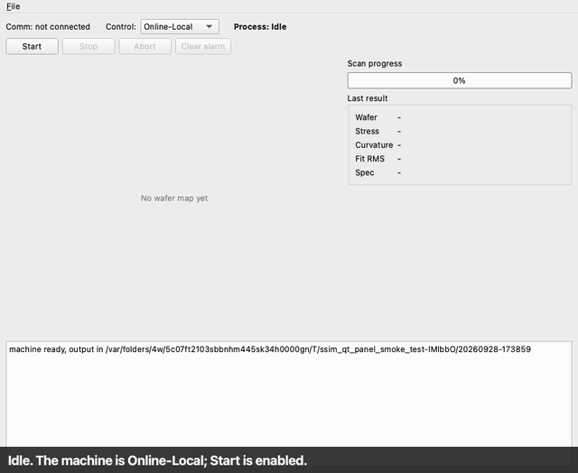

# StressScan-Sim

A simulator of a cassette-to-cassette wafer film-stress metrology tool, written
as a portfolio project in C++17.

[](https://github.com/habibour/semiconductor_metrology_software/actions/workflows/ci.yml)
[](https://github.com/habibour/semiconductor_metrology_software/actions/workflows/sanitizers.yml)
[](https://github.com/habibour/semiconductor_metrology_software/actions/workflows/release.yml)

**Status: tag `v0.3`, refactored and optimized with measured numbers.** The
standalone machine, the headless CLI and the Qt operator panel work. The
optional SECS/GEM module is a subset of publicly documented behaviour
(SECS-II codec, HSMS session and server, GEM communication and control
states, remote commands, events, alarms, status variables, S9 errors) with a
scripted host simulator, seven scenario scripts and an interop test against
an independent open-source host. A lock-free sample-path queue, a rewritten
analysis filter, a 1,000-wafer soak test, an HSMS mutation fuzz test and
measured line coverage were added and recorded in `docs/benchmarks.md`. It is
not a certified or complete GEM implementation, and it has one open
verification gap: `scripts/check_stress.m`'s independent Stoney cross-check
has not actually run in Octave or MATLAB yet (see Known limitations). The
cassette loop, equipment constants and dynamic reports are still not built.

## What it is, in plain English

Think of a washing machine with a phone app. The machine works alone: you load
it, press start, and it runs a cycle. The app is an optional extra that can
start the machine remotely.

Here the "clothes" are silicon wafers and the "cycle" is a laser scan that
measures how much a thin coating bends the wafer. The bend is turned into a
number (film stress) with Stoney's equation. There is no real laser or motor:
a simulator invents noisy readings from a hidden "true" stress, and the machine
software has to recover it. Because the answer is known, any error is
measurable.

Build order: (1) a fully working standalone machine, (2) SECS/GEM added later as
a separate module, (3) refactor and optimise with measured numbers.

No Frontier or SEMI names, logos or standard text are used anywhere in this
repository. SECS/GEM is described as a subset based on publicly documented
behaviour, never as certified or complete.

## Architecture

```
        optional link: TCP, HSMS / SECS-II / GEM
 +------------------+  <------------------------------->  +----------------------------------+
 | Host simulator   |                                     | Equipment application            |
 | (host_sim)       |                                     |  +----------------------------+  |
 +------------------+                                     |  | SECS/GEM module (optional) |  |
                                                          |  +-------------+--------------+  |
 +------------------+   operator actions / display        |                | commands / events |
 | Operator (Qt)    | <---------------------------------> |  +-------------v--------------+  |
 +------------------+                                     |  | Core library               |  |
                                                          |  | controller, pipeline, logs |  |
                                                          |  +-------------+--------------+  |
                                                          |                | IStage / ILaserSensor |
                                                          |  +-------------v--------------+  |
                                                          |  | Simulated hardware         |  |
                                                          |  +----------------------------+  |
                                                          +----------------------------------+
```

Modules (dependencies point downward only): `ssim_core` (config, queues, event
bus, controller, state machines, `MachineApi`), `ssim_hw` (hardware interfaces
and simulated devices), `ssim_analysis` (filters, fit, Stoney stress, wafer map,
writers), `ssim_secsgem` (HSMS session/timers, SECS-II codec, GEM states and
handlers), `ssim_machine` (`MachineRuntime`, which wires all of the above
together and hosts the optional SECS/GEM link), then the `equipment_cli`,
`equipment_qt` and `host_sim` executables. `ssim_core` never includes Qt,
network or SECS/GEM headers, and the machine builds, passes its tests and
completes a scan with the SECS/GEM module entirely absent
(`-DSSIM_ENABLE_SECSGEM=OFF`). The reasoning is in `docs/PRD.md` and
`docs/decisions/`.

## Build and run (macOS, Apple Silicon)

Requirements: CMake 3.21+, a C++17 compiler, Qt 6 for the panel (optional).

```
# headless machine and tests
cmake --preset dev
cmake --build build -j2
ctest --test-dir build --output-on-failure

# one scan from the command line; writes results/<run_id>/W001/
./build/src/app_cli/equipment_cli --config config/default.json --rtf 0
```

Timed for real from a genuinely fresh `git clone` (no cached dependencies,
no prior build): configure 5m52s, build 2m29s, `ctest` (365 tests, including
the 1,000-wafer soak test at ~90s) 2m13s &mdash; **10m34s total**, over this
project's own 10-minute target. Configure dominates on a first run because
it fetches nlohmann/json, Asio, GoogleTest and stb; a second `cmake --build`
with those already fetched and cached is well under a minute.

Qt panel (needs Qt 6, for example `brew install qtbase`; the preset assumes it
is in `/opt/homebrew/opt/qtbase`, edit `CMakePresets.json` if yours differs):

```
cmake --preset qt
cmake --build build-qt -j2
./build-qt/src/app_qt/equipment_qt --config config/demo_alarm.json
```

Notes from the machine this was developed on:

- `-j2` is deliberate: with many parallel jobs, GoogleTest's 5-second test
  discovery step can time out on the first build.
- If your `cmake` is an Intel build running under Rosetta, add
  `-DCMAKE_OSX_ARCHITECTURES=arm64` for anything that links arm64 libraries
  (the `qt` preset already does).

### Running the machine with a host

```
# the machine, listening on a port chosen by the OS (loopback only), Online-Remote
./build/src/app_cli/equipment_cli serve --port 0 --control remote --rtf 0
# prints:  listening on 127.0.0.1:<port>

# in another terminal: run a scenario script against it
./build/src/host_sim/host_sim --connect 127.0.0.1:<port> --script scenarios/normal_run.scn

# the independent interop check (needs: pip install secsgem==0.3.0)
python3 scripts/interop_secsgem.py --cli build/src/app_cli/equipment_cli --config config/demo_alarm.json
```

The script language is described in `docs/scenario-format.md`. Configure with
`-DSSIM_INTEROP_PYTHON=<python with secsgem>` to have CTest run the interop
check as `XT-SECSGEM-1`; without it CTest says at configure time that the test
is not registered.

### Using the panel

`config/demo_alarm.json` is set up for a short demo: the first wafer (W001)
scans cleanly, the second (W002) has an injected sensor-spike fault.

1. Press Start and watch progress; the wafer map and result appear when it ends.
2. Start again: W002 raises alarm 1001, the red banner appears and Start stays
   disabled until you press Clear alarm.
3. Switch Control to Online-Remote: Start is disabled (the host is in charge),
   while Abort stays available.
4. File > Load config... and File > Settings... rebuild the machine; both are
   only possible while idle. File > Open results folder shows the output files.

## Demo



The panel scanning wafer W001 (progress, then the wafer map and the result, stress
-180.0 MPa recovered), wafer W002 raising a sensor alarm that blocks Start until it
is cleared, and Online-Remote disabling the operator's Start. **This is not a screen
recording:** the frames are rendered by the real panel widgets on Qt's offscreen
platform while a scripted session drives them, then assembled into a GIF
(`scripts/make_demo_gif.sh`, which needs a Qt build and `pip install pillow`).
Day 6's work was all backend (queue, analysis, tests, docs) and did not touch
the panel's widgets or behaviour, so this GIF is still an accurate
representation as of tag `v0.3`.

**Video:** a two-minute walkthrough is linked here once recorded (panel
start, switch to Remote, run the host script, watch a scan, the result and
map, trigger and clear a sensor alarm, and the CI badges above).

**One-command local demo:** `scripts/demo.sh` builds if needed, starts the
machine with the SECS/GEM link on a free port, runs `scenarios/normal_run.scn`
against it with `host_sim`, prints the full message trace, leaves the
wafer's results on disk, and shuts the machine down. No Docker (a deliberate
scope decision, PRD D-11).

**Release:** a prebuilt, unsigned macOS (Apple Silicon) app is attached to
each [GitHub Release](https://github.com/habibour/semiconductor_metrology_software/releases)
from tag `v0.3` onward. Gatekeeper will refuse to open an unsigned,
unnotarized app by double-click; run `xattr -cr StressScan-Sim.app` once
after unzipping it to clear the quarantine flag, then it opens normally.

## What is verified

Run `ctest` for the current list. At the time of writing the dev build (which
includes the SECS/GEM module) has 365 passing tests. With
`-DSSIM_ENABLE_SECSGEM=OFF` the same core/hardware/analysis suite (164 tests)
still builds and passes, so the machine does not depend on the module. The
build with the Qt panel adds an offscreen test that clicks through the real
window (165 tests). Only what has actually been run is claimed here.

Day 6 added: an HSMS frame/session mutation fuzz test (150,000 iterations,
on top of the SECS-II codec's existing 100,000), a 1,000-wafer soak test with
a churning host connection (zero deadlocks on every run made), and measured
line coverage (`ssim_core` 86.76%, `ssim_analysis` 94.08%, `ssim_secsgem`
92.97%, `llvm-cov`, all above the project's own 80% target). Full numbers,
including two honest misses, are in `docs/benchmarks.md`.

SECS/GEM subset (this project's own implementation):

- The SECS-II codec is tested with known answers, round trips at every length
  boundary, every rejection case, and 100,000 seeded mutated inputs.
- The HSMS session's timers T3, T6, T7 and T8 are tested on a fake clock, and
  the server on loopback sockets.
- The GEM layer is tested with the real controller and fake sockets (33 tests).
- Seven scenario scripts (`scenarios/`) run against a real machine over a real
  socket: normal run, alarm recovery, bad commands, wrong control state,
  malformed frames, link loss and T3 timeout.
- **Interop (XT-SECSGEM-1):** the independent Python library `secsgem` 0.3.0,
  acting as a host, performed S1F13, S1F3 and S2F41 and received S6F11 and S5F1
  against `equipment_cli serve`: 15 of 15 checks passed, and a run set up to
  fail did fail. Details and what it does not confirm are in
  `docs/protocol-notes.md`.

Continuous integration (GitHub Actions, macOS runner, badges above): the full
build with the interop test, the build without the SECS/GEM module, the
format check, AddressSanitizer with UBSan, and ThreadSanitizer. All five were
green through tag `v0.2`; Day 6 added new threaded code (the lock-free ring
buffer, per-line filtering on the pool), so its own sanitizer run on the
pushed `v0.3` tag is what actually checks it, not an assumption carried over
from `v0.2` — check the Sanitizers badge above for the current answer.
Sanitizers do not run on the developer's own Mac at all (the sanitizer
runtime fails even on an empty program there), so the runner is the only
place they are checked.

Not verified yet:

- Only macOS on Apple Silicon is supported and tested. Linux and Windows are
  out of scope by design (PRD D-11).
- The cassette-run scenario (ST-cassette_run) does not exist: the cassette
  loop is not built.
- The Octave/MATLAB cross-check has not run in Octave or MATLAB (see Known
  limitations and the Results table).

## Results

Full numbers, environment and method for every row: `docs/benchmarks.md`.

| Item | Value | Method |
|---|---|---|
| Stress recovery accuracy | Within 2% of the hidden truth (known-answer tests assert this; a real run measured 0.001% off) | `ctest`, `MachineRuntimeTest.StartProducesResultWithinTwoPercentOfTruth` |
| Analysis time per wafer (6 lines, 72,006 samples) | 112.7 ms baseline &rarr; 7.5&ndash;30 ms after optimization, depending on thread count | `bench/bench_analysis`, Release, Apple M4 |
| Sample-path queue throughput, v1 (mutex) vs v2 (lock-free ring) | 8-byte items: 21.6 &rarr; 127.7 M/s (5.9x). 64-byte items: 19.4 &rarr; 36.4 M/s (1.9x, below the 2x target &mdash; reported as measured, not adjusted) | `bench/bench_queue`, Release, Apple M4 |
| SECS-II codec throughput | 451k encode+decode ops/s vs a 100k target (4.5x over) | `bench/bench_codec`, Release, Apple M4 |
| SECS/GEM interop (independent Python `secsgem` host) | 15 of 15 checks passed | `scripts/interop_secsgem.py`, XT-SECSGEM-1 |
| Line coverage (target 80%) | `ssim_core` 86.76%, `ssim_analysis` 94.08%, `ssim_secsgem` 92.97% | `llvm-cov`, Debug instrumented build |
| Fuzz testing | SECS-II codec 100,000 mutated inputs; HSMS session/decoder 150,000 mutated streams &mdash; zero crashes or hangs | `ctest`, local (ASan/UBSan/TSan confirmed on the GitHub macOS runner, see badges above) |
| Soak test | 1,000 wafers, host connection dropped at random throughout &mdash; zero deadlocks every run. Memory-growth check uses a 10% bound, not the project's own 5% target, because single-run readings on a process this small swing several percent from allocator noise alone (reasoning in the test file) | `ctest`, `Soak.ThousandWafersWithHostChurnNoDeadlockBoundedMemoryGrowth` |
| Octave/MATLAB independent cross-check | **Not run.** `scripts/check_stress.m` exists; Octave failed to install on the development machine. The same formulas were checked in Python against a real run instead: 0.0100% difference from the machine's own answer &mdash; real, but not the same as an Octave run | see Known limitations |
| Test count | 365 with the SECS/GEM module, 164 without it, 165 with the Qt panel &mdash; all currently passing | `ctest --test-dir build` |

## Known limitations

- Only macOS on Apple Silicon is supported and tested (a deliberate scope
  decision, PRD D-11); nothing here claims Linux or Windows support.
- No real hardware, ever &mdash; every device is simulated behind an interface.
  This is not a certified or complete SECS/GEM implementation, and nothing in
  this repository is affiliated with, or claims to be, any commercial
  equipment vendor's product.
- The sample-path queue's v2 lock-free ring meets its 2x throughput target
  for 8-byte items (5.9x) but not for 64-byte items (1.9x) &mdash; a real,
  measured result, not adjusted to look better (`docs/benchmarks.md`).
- The 1,000-wafer soak test's memory-growth check uses a 10% bound instead of
  the project's own 5% target: single-run readings on a process this size
  swing several percent from allocator noise alone on the development
  machine, independent of any real leak (reasoning and five separate runs in
  `tests/integration/soak_test.cpp`'s header comment).
- `scripts/check_stress.m`, the independent Octave/MATLAB cross-check of the
  Stoney/curvature computation, has not actually run in Octave or MATLAB:
  `brew install octave` failed on the development machine (a missing build
  tool and an unsupported configuration for this platform). The same
  formulas were verified instead with an independent Python
  re-implementation against a real run (0.0100% difference from the
  machine's own answer) &mdash; a real check, but not an Octave run, and not
  claimed as one anywhere in this repository.
- Equipment constants (S2F13-16) and dynamic reports (S2F33-38) are not
  implemented and answer S9F5; there is no spooling; the communication state
  model is simplified from the full GEM state model (deviation documented in
  `docs/protocol-notes.md`); the cassette loop is not implemented; the panel
  shows raw heights, so the simulated wafer tilt dominates the map.

## How to explain this in an interview

This project is a multithreaded C++17 simulator, not a UI demo: a controller
thread owns machine state exclusively, a scan thread and a bounded
producer-consumer queue hand samples to a processing pool, and an optional
HSMS/SECS-II/GEM link runs on its own Asio I/O thread, all coordinated
through an event bus rather than shared mutable state (`docs/architecture.md`
has the real lock hierarchy: nine mutexes total, none ever nested, verified
by reading every one). The SECS/GEM module is explicitly a *subset* &mdash;
it is not certified, does not claim completeness, and every message layout
was cross-checked against an independent open-source library before being
trusted. Film-stress recovery is validated the way a metrology tool should
be: a known-answer test injects a hidden truth and asserts the recovered
value is close, not just that the code runs. The performance story is
measure-first throughout &mdash; the outlier filter and the sample queue were
each optimized only after a benchmark showed where the time actually went,
and the queue's result is reported honestly even where it fell short of its
own target (64-byte items). What was cut, and why: Tier 2/3 items (a C#
host, a firmware-style device simulator over TCP, Windows/WPF) were dropped
first, in the order the PRD itself sets, once the Tier 1 standalone-machine
and SECS/GEM-integration work was solid &mdash; the honest story of a
prioritized week, not a claim that everything was built.

## Licence

This project's own code: MIT, see `LICENSE`. Third-party dependencies (Qt
LGPL v3 with dynamic linking, Asio Boost Software License 1.0, GoogleTest
BSD-3-Clause, nlohmann/json MIT, stb public domain/MIT dual) are listed with
their exact pinned versions in `THIRD_PARTY_LICENSES.md`.

## Design records and further reading

- `docs/PRD.md` &mdash; the full requirements document this README is built from.
- `docs/architecture.md` &mdash; the real lock hierarchy and thread-confinement design.
- `docs/benchmarks.md` &mdash; every measured number in this README, with environment and method.
- `docs/decisions/0001-networking-library.md` &mdash; why standalone Asio over Qt Network.
- `docs/decisions/0002-machine-runtime-library.md` &mdash; why `ssim_machine`/`MachineRuntime` exists as a shared composition root.
- `docs/decisions/0003-sans-io-hsms-session.md` &mdash; why the HSMS session is a pure state machine, decoupled from the socket.
- `docs/protocol-notes.md` &mdash; SECS/GEM layout cross-checks against the `secsgem` library, and open `TODO(verify)` items.
